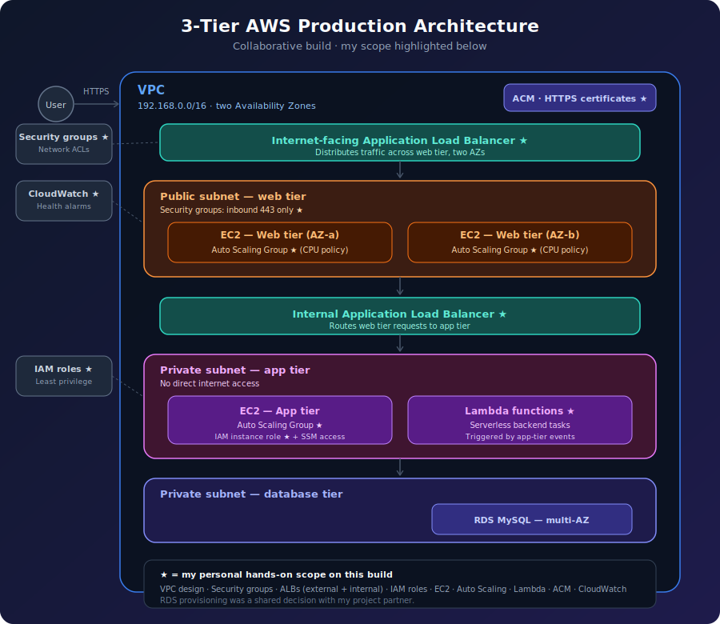

<div align="center">


<a href="https://www.linkedin.com/in/soumya-r-rout/">
  
</a>
<a href="mailto:soumyaranjanrout491@gmail.com">
  
</a>


<br/><br/>

<a href="https://git.io/typing-svg">
  
</a>

</div>

<br/>

## 🚀 About me

I'm an entry-level **Cloud & DevOps Engineer** from Cuttack, Odisha, India — B.Tech in Computer Science (BPUT, 2025) — with hands-on training in AWS & DevOps from Naresh IT, Hyderabad. I'm passionate about building secure, scalable cloud infrastructure and automating everything that can be automated.

```yaml
role:        Cloud / DevOps Engineer (entry-level)
based_in:    Cuttack, Odisha, India
focus:       AWS infrastructure · Infrastructure as Code · CI/CD pipelines
learning:    Kubernetes · GenAI on cloud (RAG, LLMs, AWS Bedrock) · advanced Terraform
open_to:     Cloud/DevOps roles · open-source infra collaboration
contact:     soumyaranjanrout491@gmail.com · routashish427@gmail.com
```

<br/>

## 🛠️ Tech stack

<div align="center">


</div>

| Category | Skills |
|---|---|
| ☁️ **AWS Services** | EC2 · S3 · IAM · VPC · RDS · Lambda · API Gateway · DynamoDB (exposure) · ALB · Auto Scaling · CloudWatch · Route 53 · ACM · SSM · CloudFront |
| ⚙️ **DevOps & CI/CD** | Docker · Git & GitHub · Jenkins · GitHub Actions · Terraform (IaC) · Kubernetes (hands-on labs) |
| 🔌 **APIs & Integration** | REST APIs · JSON · Auth basics (IAM, token concepts) |
| 🤖 **GenAI / ML awareness** | LLM concepts · RAG patterns · AWS Bedrock (conceptual) · Prompt engineering |
| 🌐 **Networking & Security** | Subnetting · VLANs · Routing · ACLs · DHCP · DNS · IAM least privilege · Security groups · NACLs |
| 🐧 **OS** | Linux — shell, permissions, services, process management, log analysis |

<br/>

## 📜 Certifications

<div align="center">

[](#)
[](#)
[](#)
[](#)

</div>

| Certification | Issued | Valid until | Credential ID |
|---|---|---|---|
| Oracle Cloud Infrastructure 2025 Certified DevOps Professional | Sep 29, 2025 | Sep 29, 2027 | `102541946OCI25DOPOCP` |
| Oracle Cloud Infrastructure 2025 Certified Architect Associate | Sep 15, 2025 | Sep 15, 2027 | `102541946OCI25CAA` |
| Oracle Cloud Infrastructure 2025 Certified Generative AI Professional | Sep 15, 2025 | Sep 15, 2027 | `102641280OCI25GAIOCP` |
| Cisco CCNAv7: Switching, Routing & Wireless Essentials | — | — | — |
| Cisco CCNAv7: Enterprise Networking, Security & Automation | — | — | — |

> 💡 Swap the `#` links above for your Oracle CertView share URLs once you have them — clickable proof beats a static badge.

<br/>

## 🏗️ Featured project — 3-tier AWS architecture

<div align="center">

</div>

A production-style 3-tier architecture on AWS, built collaboratively for high availability and security across two Availability Zones. The diagram above marks **(★) my personal hands-on scope**:

- Designed the **VPC** with public/private subnet segmentation
- Configured **Security Groups** and NACLs for least-privilege network access
- Set up **internet-facing and internal Application Load Balancers**
- Defined **IAM roles** for secure, scoped service access
- Provisioned **EC2** instances with **Auto Scaling Groups** (CPU-based policies) across the web and app tiers
- Built **Lambda functions** for event-driven backend tasks
- Configured **ACM** for HTTPS and **CloudWatch alarms** for health monitoring

`AWS` `VPC` `IAM` `ALB` `EC2` `Auto Scaling` `Lambda` `ACM` `CloudWatch` `Security Groups`

> 📌 Repo coming soon — once pushed, this section will link straight to the IaC and architecture docs.

<br/>


## 🤝 Connect with me

<div align="center">

[](https://www.linkedin.com/in/soumya-r-rout/)
[](mailto:soumyaranjanrout491@gmail.com)
[](mailto:routashish427@gmail.com)

<i>Thanks for stopping by — always open to connecting on Cloud/DevOps roles and projects.</i>


</div>
